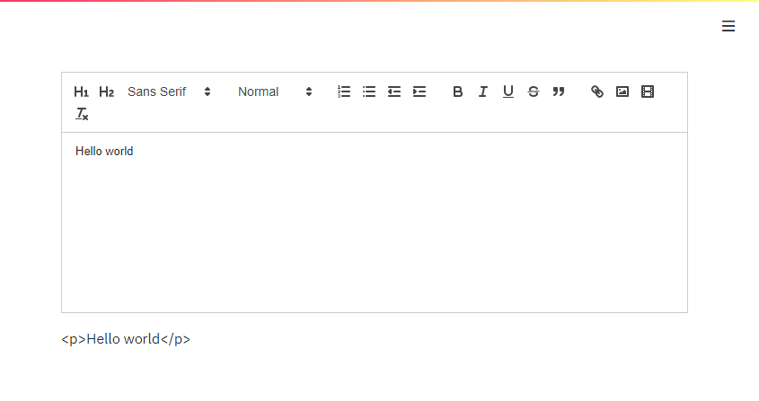

# Streamlit Quill

[React Quill](https://github.com/zenoamaro/react-quill) component for [Streamlit](https://www.streamlit.io/).

## Installation

In a python virtual environment, run:

```sh
pip install https://github.com/Ghasel/streamlit-quill/releases/download/0.0.1/streamlit_quill-0.0.1-py3-none-any.whl
```

## Demo

To test this component, you can run the demo script:

```sh
streamlit run https://raw.githubusercontent.com/Ghasel/streamlit-quill/master/examples/streamlit_quill_demo.py
```


